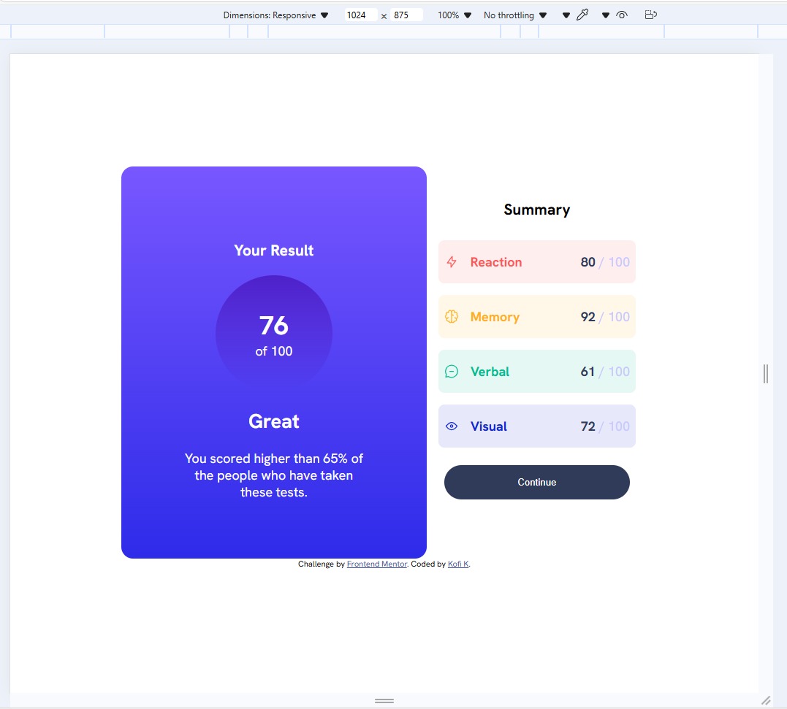
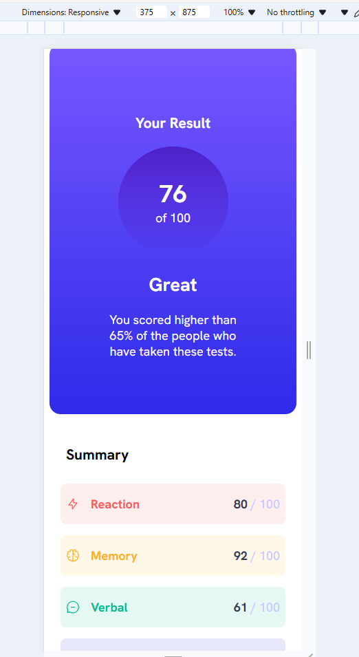

# Frontend Mentor - Results summary component solution

This is a solution to the [Results summary component challenge on Frontend Mentor](https://www.frontendmentor.io/challenges/results-summary-component-CE_K6s0maV). Frontend Mentor challenges help you improve your coding skills by building realistic projects. 

## Table of contents

- [Overview](#overview)
  - [The challenge](#the-challenge)
  - [Screenshot](#screenshot)
  - [Links](#links)
- [My process](#my-process)
  - [Built with](#built-with)
  - [What I learned](#what-i-learned)
  - [Continued development](#continued-development)
  - [Useful resources](#useful-resources)
- [Author](#author)
- [Acknowledgments](#acknowledgments)

**Note: Delete this note and update the table of contents based on what sections you keep.**

## Overview

### The challenge

Users should be able to:

- View the optimal layout for the interface depending on their device's screen size
- See hover and focus states for all interactive elements on the page
- **Bonus**: Use the local JSON data to dynamically populate the content

### Screenshot



Desktop Mode



Mobile Mode


Active/Focus/Hover State of Button

### Links

- Solution URL: [https://www.frontendmentor.io/solutions/summary-page-using-htmlcss-aDwY8K6VwD](https://www.frontendmentor.io/solutions/summary-page-using-htmlcss-aDwY8K6VwD)
- Live Site URL: [https://kofi100.github.io/ResultsSummary28Nov2024/](https://kofi100.github.io/ResultsSummary28Nov2024/)

## My process

### Built with

- Semantic HTML5 markup
- CSS custom properties
- Flexbox

**Note: These are just examples. Delete this note and replace the list above with your own choices**

### What I learned

Managed to learn how to effectively switch a view from horizontal to vertical when the screen is on mobile and also to change the position 
of the Summary title when on Mobile by placing the Summary title on a div element and tweaking its properties to fill up all available space on its place/position.
I wish I could remember what else I learnt but I'll try to deal with it later.


This is the code btw.
```css
@media (max-width:47rem) {
    /* settings for screens below tablet screen size. */
    /* This is for the main card. */
    .card{
        flex-direction: column;
    }
    /* h3{
        text-align: left;
    } */
     /* this is the div element having the Summary Title btw */
    .card__box2__SummaryTitleDiv{
        width: 100%;
        text-align: left;
    }
}
```


If you want more help with writing markdown, we'd recommend checking out [The Markdown Guide](https://www.markdownguide.org/) to learn more.


### Continued development
For now,maybe changing my variable naming methods.I dont think it's that necessary for now.

<!-- Use this section to outline areas that you want to continue focusing on in future projects. These could be concepts you're still not completely comfortable with or techniques you found useful that you want to refine and perfect. -->

## Author

- Website - [Add your name here](https://www.your-site.com)
- Frontend Mentor - [@Kofi100](https://www.frontendmentor.io/profile/Kofi100)
- Twitter - [@yourusername](https://www.twitter.com/yourusername)


## Acknowledgments

This is where you can give a hat tip to anyone who helped you out on this project. Perhaps you worked in a team or got some inspiration from someone else's solution. This is the perfect place to give them some credit.

